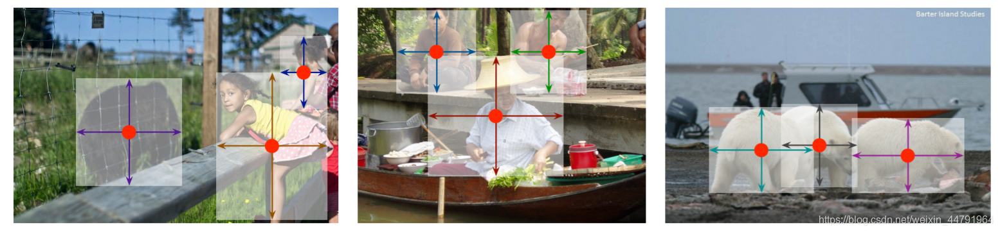

# 什么是Centernet目标检测算法


如今常见的目标检测算法通常使用先验框的设定，即先在图片上设定大量的先验框，网络的预测结果会对先验框进行调整获得预测框，先验框很大程度上提高了网络的检测能力，但是也会收到物体尺寸的限制。

Centernet采用不同的方法，构建模型时将目标作为一个点——即目标BBox的中心点。

Centernet的检测器采用关键点估计来找到中心点，并回归到其他目标属性。


> Centernet的实现思路非常简单,centernet的预测结果会将输入进来的图片划分成不同的区域,每个区域都会有一个特征点,centernet网络的预测结果就会判断这个特征是否有对应的物体,以及物体的种类和置信度;同时还会对特征点进行调整获得物体的中心坐标;还会回归预测出物体的高宽

论文中提到：模型是端到端可微的，更简单，更快，更精确。Centernet的模型实现了速度和精确的很好权衡。

# 源码下载

https://github.com/bubbliiiing/centernet-pytorch
 喜欢的可以点个star噢。

# Centernet实现思路

## 一、预测部分

### 1、主干网络介绍

Centernet用到的主干特征网络有多种，**一般是以Hourglass Network、DLANet或者Resnet为主干特征提取网络，由于centernet所用到的Hourglass Network参数量太大，有19000W参数，DLANet并没有keras资源，本文以Resnet为例子进行解析。**

ResNet50有两个基本的块，**分别名为Conv Block和Identity Block，其中Conv Block输入和输出的维度是不一样的，所以不能连续串联，它的作用是改变网络的维度；Identity Block输入维度和输出维度相同，可以串联，用于加深网络的。**

> Conv Block的结构如下：


> Identity Block的结构如下：


这两个都是残差网络结构。
 当我们输入的图片是512x512x3的时候，整体的特征层shape变化为：


我们取出最终一个block的输出进行下一步的处理。也就是图上的C5，它的shape为16x16x2048。利用主干特征提取网络，我们获取到了一个初步的特征层，其shape为16x16x2048。

> nets/resnet50.py

```python
from __future__ import absolute_import, division, print_function

import math
import torch.nn as nn
from torch.hub import load_state_dict_from_url

model_urls = {
    'resnet18': 'https://s3.amazonaws.com/pytorch/models/resnet18-5c106cde.pth',
    'resnet34': 'https://s3.amazonaws.com/pytorch/models/resnet34-333f7ec4.pth',
    'resnet50': 'https://s3.amazonaws.com/pytorch/models/resnet50-19c8e357.pth',
    'resnet101': 'https://s3.amazonaws.com/pytorch/models/resnet101-5d3b4d8f.pth',
    'resnet152': 'https://s3.amazonaws.com/pytorch/models/resnet152-b121ed2d.pth',
}

#-------------------------------------------------------------------------#
#   主干: 卷积+bn+relu -> 卷积+bn+relu -> 卷积+bn
#   短接: 卷积+bn
#   短接后有relu
#-------------------------------------------------------------------------#
class Bottleneck(nn.Module):
    expansion = 4

    def __init__(self, inplanes, planes, stride=1, downsample=None):
        super().__init__()
        self.conv1 = nn.Conv2d(inplanes, planes, kernel_size=1, stride=stride, bias=False) # change
        self.bn1 = nn.BatchNorm2d(planes)
        self.conv2 = nn.Conv2d(planes, planes, kernel_size=3, stride=1, padding=1, bias=False) # change
        self.bn2 = nn.BatchNorm2d(planes)
        self.conv3 = nn.Conv2d(planes, planes * 4, kernel_size=1, bias=False)
        self.bn3 = nn.BatchNorm2d(planes * 4)

        # relu是共用的
        self.relu = nn.ReLU(inplace=True)
        self.downsample = downsample
        self.stride = stride

    def forward(self, x):
        residual = x

        out = self.conv1(x)
        out = self.bn1(out)
        out = self.relu(out)

        out = self.conv2(out)
        out = self.bn2(out)
        out = self.relu(out)

        out = self.conv3(out)
        out = self.bn3(out)

        if self.downsample is not None:
            residual = self.downsample(x)

        out += residual
        out = self.relu(out)

        return out

#-----------------------------------------------------------------#
#   使用Renset50作为主干特征提取网络，最终会获得一个
#   16x16x2048的有效特征层
#-----------------------------------------------------------------#
class ResNet(nn.Module):
    def __init__(self, block, layers, num_classes=1000):
        self.inplanes = 64
        super().__init__()

        # 512,512,3 -> 256,256,64
        self.conv1 = nn.Conv2d(3, 64, kernel_size=7, stride=2, padding=3,bias=False)
        self.bn1 = nn.BatchNorm2d(64)
        self.relu = nn.ReLU(inplace=True)

        # 256,256,64 -> 128,128,64
        self.maxpool = nn.MaxPool2d(kernel_size=3, stride=2, padding=0, ceil_mode=True) # change

        # 128,128,64 -> 128,128,256
        self.layer1 = self._make_layer(block, 64, layers[0])

        # 128,128,256 -> 64,64,512
        self.layer2 = self._make_layer(block, 128, layers[1], stride=2)

        # 64,64,512 -> 32,32,1024
        self.layer3 = self._make_layer(block, 256, layers[2], stride=2)

        # 32,32,1024 -> 16,16,2048
        self.layer4 = self._make_layer(block, 512, layers[3], stride=2)

        self.avgpool = nn.AvgPool2d(7)
        self.fc = nn.Linear(512 * block.expansion, num_classes)

        for m in self.modules():
            if isinstance(m, nn.Conv2d):
                n = m.kernel_size[0] * m.kernel_size[1] * m.out_channels
                m.weight.data.normal_(0, math.sqrt(2. / n))
            elif isinstance(m, nn.BatchNorm2d):
                m.weight.data.fill_(1)
                m.bias.data.zero_()

    def _make_layer(self, block, planes, blocks, stride=1):
        downsample = None
        # 步长不为1或者进出通道不相等就设置下采样层 conv+bn 没有relu
        if stride != 1 or self.inplanes != planes * block.expansion:
            # conv+bn
            downsample = nn.Sequential(
                nn.Conv2d(self.inplanes, planes * block.expansion, kernel_size=1, stride=stride, bias=False),
                nn.BatchNorm2d(planes * block.expansion),
        )

        layers = []
        # 第一次有短阶层
        layers.append(block(self.inplanes, planes, stride, downsample))
        self.inplanes = planes * block.expansion
        # 后面没有短接层
        for i in range(1, blocks):
            layers.append(block(self.inplanes, planes))

        return nn.Sequential(*layers)

    def forward(self, x):
        x = self.conv1(x)
        x = self.bn1(x)
        x = self.relu(x)    # 512,512,3   -> 256,256,64
        x = self.maxpool(x) # 256,256,64  -> 128,128,64

        x = self.layer1(x)  # 128,128,64  -> 128,128,256
        x = self.layer2(x)  # 128,128,256 -> 64,64,512
        x = self.layer3(x)  # 64,64,512   -> 32,32,1024
        x = self.layer4(x)  # 32,32,1024  -> 16,16,2048

        x = self.avgpool(x)
        x = x.view(x.size(0), -1)
        x = self.fc(x)

        return x

def resnet50(pretrained = True):
    model = ResNet(Bottleneck, [3, 4, 6, 3])
    if pretrained:
        state_dict = load_state_dict_from_url(model_urls['resnet50'], model_dir = 'model_data/')
        model.load_state_dict(state_dict)
    #----------------------------------------------------------#
    #   获取特征提取部分
    #----------------------------------------------------------#
    features = list([model.conv1, model.bn1, model.relu, model.maxpool, model.layer1, model.layer2, model.layer3, model.layer4])
    features = nn.Sequential(*features)
    return features
```

### 2、利用初步特征获得高分辨率特征图


利用上一步获得到的resnet50的最后一个特征层的shape为(16,16,2048)。

**对于该特征层，centernet利用三次反卷积进行上采样，从而更高的分辨率输出。为了节省计算量，这3个反卷积的输出通道数分别为256,128,64。**

每一次反卷积，特征层的高和宽会变为原来的两倍，因此，在进行三次反卷积上采样后，我们**获得的特征层的高和宽变为原来的8倍**，此时特征层的高和宽为128x128，通道数为64。

**此时我们获得了一个128x128x64的有效特征层（高分辨率特征图），我们会利用该有效特征层获得最终的预测结果。**

> nets/resnet50.py

```python
#----------------------------------------------------------#
#   加强特征提取部分,使用转置卷积
#   每次转置卷积后特征层的宽高变为原来的两倍。
#   $HW_{out} = (HW_{in} - 1) * stride - 2 * padding + kernel\_size$
#   32 = (a-1) * 2 - 2 * 1 + 4 = 2x - 2 - 2 + 4 = 2a
#----------------------------------------------------------#
class resnet50_Decoder(nn.Module):
    def __init__(self, in_channels, bn_momentum=0.1):
        super().__init__()
        self.in_channels = in_channels
        self.bn_momentum = bn_momentum
        self.deconv_with_bias = False

        #----------------------------------------------------------#
        #   16,16,2048 -> 32,32,256 -> 64,64,128 -> 128,128,64
        #   利用ConvTranspose2d进行上采样。
        #   每次特征层的宽高变为原来的两倍。
        #----------------------------------------------------------#
        self.deconv_layers = self._make_deconv_layer(
            num_layers=3,               # 重复3次
            num_filters=[256, 128, 64], # 3次的out_channels
            num_kernels=[4, 4, 4],      # 3次的kernel_size
        )

    def _make_deconv_layer(self, num_layers, num_filters, num_kernels):
        layers = []
        for i in range(num_layers):
            kernel_size  = num_kernels[i] # kernel_size
            out_channels = num_filters[i] # out_channels

            layers.append(
                nn.ConvTranspose2d(
                    in_channels =self.in_channels,
                    out_channels=out_channels,
                    kernel_size =kernel_size,
                    stride      =2,
                    padding     =1,
                    output_padding=0,
                    bias=self.deconv_with_bias))
            layers.append(nn.BatchNorm2d(out_channels, momentum=self.bn_momentum))
            layers.append(nn.ReLU(inplace=True))
            self.in_channels = out_channels
        return nn.Sequential(*layers)

    def forward(self, x):
        return self.deconv_layers(x)    # 128,128,64
```

### 3、Center Head从特征获取预测结果


通过上一步我们可以获得一个128x128x64的高分辨率特征图。

这个特征层相当于将整个图片划分成128x128个区域，**每个区域存在一个特征点，如果某个物体的中心落在这个区域，那么就由这个特征点来确定。**
（**某个物体的中心落在这个区域，则由这个区域左上角的特征点来约定**）

我们可以利用这个特征层进行三个卷积，分别是：

1. **热力图预测，此时卷积的通道数为num_classes，最终结果为(128,128,num_classes)，代表每一个热力点是否有物体存在，以及物体的种类；**
2. **中心点预测，此时卷积的通道数为2，最终结果为(128,128,2)，代表每一个物体中心距离热力点偏移的情况；**
3. **宽高预测，此时卷积的通道数为2，最终结果为(128,128,2)，代表每一个物体宽高的预测情况；**



> nets/resnet50.py

```python
#----------------------------------------------------------#
#   头部分
#----------------------------------------------------------#
class resnet50_Head(nn.Module):
    def __init__(self, num_classes=80, hidden_channels=64, bn_momentum=0.1):
        super(resnet50_Head, self).__init__()
        #-----------------------------------------------------------------#
        #   对获取到的特征进行上采样，进行分类预测和回归预测
        #   128, 128, 64 -> 128, 128, 64 -> 128, 128, num_classes   分类
        #   128, 128, 64 -> 128, 128, 64 -> 128, 128, 2             框的宽高回归
        #   128, 128, 64 -> 128, 128, 64 -> 128, 128, 2             中心位置回归
        #-----------------------------------------------------------------#

        #-----------------------------------------------------------------#
        # 热力图预测部分    3x3Conv+BN+Relu + 1x1Conv
        #-----------------------------------------------------------------#
        self.cls_head = nn.Sequential(
            nn.Conv2d(64, hidden_channels, kernel_size=3, padding=1, bias=False),
            nn.BatchNorm2d(64, momentum=bn_momentum),
            nn.ReLU(inplace=True),
            nn.Conv2d(hidden_channels, num_classes, kernel_size=1))

        #-----------------------------------------------------------------#
        # 宽高预测的部分    3x3Conv+BN+Relu + 1x1Conv
        #-----------------------------------------------------------------#
        self.wh_head = nn.Sequential(
            nn.Conv2d(64, hidden_channels, kernel_size=3, padding=1, bias=False),
            nn.BatchNorm2d(64, momentum=bn_momentum),
            nn.ReLU(inplace=True),
            nn.Conv2d(hidden_channels, 2, kernel_size=1))

        #-----------------------------------------------------------------#
        # 中心点预测的部分  3x3Conv+BN+Relu + 1x1Conv
        #-----------------------------------------------------------------#
        self.reg_head = nn.Sequential(
            nn.Conv2d(64, hidden_channels, kernel_size=3, padding=1, bias=False),
            nn.BatchNorm2d(64, momentum=bn_momentum),
            nn.ReLU(inplace=True),
            nn.Conv2d(hidden_channels, 2, kernel_size=1))

    def forward(self, x):
        hm = self.cls_head(x).sigmoid_()    # 分类数都变为0~1之间
        wh = self.wh_head(x)
        offset = self.reg_head(x)
        # 分类,宽高,中心
        return hm, wh, offset
```

### 4、预测结果的解码

在对预测结果进行解码之前，我们再来看看预测结果代表了什么，预测结果可以分为3个部分：

1. **heatmap热力图预测，此时卷积的通道数为num_classes，最终结果为(128,128,num_classes)，代表每一个热力点是否有物体存在，以及物体的种类，最后一维度num_classes中的预测值代表属于每一个类的概率；**
2. **reg中心点预测，此时卷积的通道数为2，最终结果为(128,128,2)，代表每一个物体中心距离热力点偏移的情况，最后一维度2中的预测值代表当前这个特征点向右下角偏移的情况；**
3. **wh宽高预测，此时卷积的通道数为2，最终结果为(128,128,2)，代表每一个物体宽高的预测情况，最后一维度2中的预测值代表当前这个特征点对应的预测框的宽高；**

特征层相当于将图像划分成128x128个特征点每个特征点负责预测中心落在其右下角一片区域的物体。


如图所示，蓝色的点为128x128的特征点，此时我们对左图红色的三个点进行解码操作演示：

1. 进行中心点偏移，**利用reg中心点预测对特征点坐标进行偏移，左图红色的三个特征点偏移后是右图橙色的三个点；**
2. 利用中心点加上和减去 **wh宽高预测结果除以2**，获得预测框的左上角和右下角。
3. 此时获得的预测框就可以绘制在图片上了。


除去这样的解码操作，还有非极大抑制的操作需要进行，防止同一种类的框的堆积。

在论文中所说，centernet不像其它目标检测算法，在解码之后需要进行非极大抑制，centernet的非极大抑制在解码之前进行。**采用的方法是最大池化**，**利用3x3的池化核在热力图上搜索，然后只保留一定区域内得分最大的框。**

**在实际使用时发现，当目标为小目标时，确实可以不在解码之后进行非极大抑制的后处理，如果目标为大目标，网络无法正确判断目标的中心时，还是需要进行非击大抑制的后处理的。**

> 

```python
#-------------------------------------------------------------------------#
#   利用maxpool来完成非极大抑制,centernet特有的非极大抑制
#-------------------------------------------------------------------------#
def pool_nms(heat, kernel = 3):
    pad = (kernel - 1) // 2
    hmax = F.max_pool2d(heat, (kernel, kernel), stride=1, padding=pad)
    keep = (hmax == heat).float()   # 返回True/False,转换为1 0
    return heat * keep              # 相乘获得要的数据 也可以 heat[keep]

#-------------------------------------------------------------------------#
#   解码
#-------------------------------------------------------------------------#
def decode_bbox(pred_hms, pred_whs, pred_offsets, confidence, cuda):
    """
    pred_hms:       种类预测
    pred_whs:       宽高偏移
    pred_offsets:   中心偏移
    confidence:     置信度
    """
    #-------------------------------------------------------------------------#
    #   当利用512x512x3图片进行coco数据集预测的时候
    #   h = w = 128 num_classes = 80
    #   Hot map热力图 -> b, 80, 128, 128,
    #   进行热力图的非极大抑制，利用3x3的卷积对热力图进行最大值筛选
    #   找出一定区域内，得分最大的特征点。
    #-------------------------------------------------------------------------#
    pred_hms = pool_nms(pred_hms)

    b, c, output_h, output_w = pred_hms.shape
    detects = []
    #-------------------------------------------------------------------------#
    #   只传入一张图片，循环只进行一次
    #-------------------------------------------------------------------------#
    for batch in range(b):
        #-------------------------------------------------------------------------#
        #   heat_map        [128*128, num_classes]    热力图
        #   pred_wh         [128*128, 2          ]    特征点的预测宽高
        #                                             在预测过程的前处理以及后处理视频中讲的有点小问题，不是调整参数，就是宽高
        #   pred_offset     [128*128, 2          ]    特征点的xy轴偏移情况
        #-------------------------------------------------------------------------#
        heat_map    = pred_hms[batch].permute(1, 2, 0).view([-1, c])        # 将通道放到最后,并且转换为二维的 c代表分类
        pred_wh     = pred_whs[batch].permute(1, 2, 0).view([-1, 2])
        pred_offset = pred_offsets[batch].permute(1, 2, 0).view([-1, 2])

        #-------------------------------------------------------------------------#
        # 根据输入图片宽高构建特征点x,y坐标
        #-------------------------------------------------------------------------#
        yv, xv      = torch.meshgrid(torch.arange(0, output_h), torch.arange(0, output_w))
        #-------------------------------------------------------------------------#
        #   xv              [128*128,]    特征点的x轴坐标
        #   yv              [128*128,]    特征点的y轴坐标
        #-------------------------------------------------------------------------#
        xv, yv      = xv.flatten().float(), yv.flatten().float()
        if cuda:
            xv      = xv.cuda()
            yv      = yv.cuda()

        #-------------------------------------------------------------------------#
        #   class_conf      128*128,    特征点的种类置信度
        #   class_pred      128*128,    特征点的种类
        #-------------------------------------------------------------------------#
        class_conf, class_pred  = torch.max(heat_map, dim = -1)
        mask                    = class_conf > confidence       # 返回 True / False  [128*128,]

        #-----------------------------------------#
        #   取出得分筛选后对应的结果
        #-----------------------------------------#
        pred_wh_mask        = pred_wh[mask]       # [128*128, 2]
        pred_offset_mask    = pred_offset[mask]   # [128*128, 2]
        # 没有超过置信度的,忽略
        if len(pred_wh_mask) == 0:
            detects.append([])
            continue

        #----------------------------------------#
        #   计算调整后预测框的中心
        #   原始坐标+偏移值就是预测中心
        #   增加最后一个维度
        #----------------------------------------#
        xv_mask = torch.unsqueeze(xv[mask] + pred_offset_mask[..., 0], -1)
        yv_mask = torch.unsqueeze(yv[mask] + pred_offset_mask[..., 1], -1)
        #----------------------------------------#
        #   计算预测框的宽高
        #   预测宽高除以2得到一半宽高
        #----------------------------------------#
        half_w, half_h = pred_wh_mask[..., 0:1] / 2, pred_wh_mask[..., 1:2] / 2
        #----------------------------------------#
        #   获得预测框的左上角和右下角坐标
        #   x1,y1,x2,y2
        #----------------------------------------#
        bboxes = torch.cat([xv_mask - half_w, yv_mask - half_h, xv_mask + half_w, yv_mask + half_h], dim=1)
        bboxes[:, [0, 2]] /= output_w   # 归一化
        bboxes[:, [1, 3]] /= output_h

        # 拼接 [x1, y1, x2, y2, 特征点的置信度, 特征点的种类]
        detect = torch.cat([bboxes, torch.unsqueeze(class_conf[mask],-1), torch.unsqueeze(class_pred[mask],-1).float()], dim=-1)
        detects.append(detect)

    return detects
```

### 5、在原图上进行绘制

通过第三步，我们可以获得预测框在原图上的位置，而且这些预测框都是经过筛选的。这些筛选后的框可以直接绘制在图片上，就可以获得结果了。

## 二、训练部分

### 1、真实框的处理

既然在centernet中，**物体的中心落在哪个特征点的右下角就由哪个特征点来负责预测**，那么在训练的时候我们就需要找到**真实框和特征点之间的关系。**

真实框和特征点之间的关系，对应方式如下：

1, **找到真实框的中心，通过真实框的中心找到其对应的特征点。**

2, 根据该**真实框的种类**，对网络**应该有的热力图进行设置**，即heatmap热力图。其实就是将**对应的特征点里面的对应的种类**，它的中心值设置为1，然后这个**特征点附近的其它特征点中该种类对应的值按照高斯分布不断下降**。


3, 除去heatmap热力图外，**还需要设置特征点对应的reg中心点和wh宽高**，在找到真实框对应的特征点后，**还需要设置该特征点对应的reg中心和wh宽高**。这里的reg中心和wh宽高都是对于128x128的特征层的。

4, 在获得网络应该有的预测结果后，**就可以将预测结果和应该有的预测结果进行对比，对网络进行反向梯度调整了。**

实现代码如下：

```python
import math

import cv2
import numpy as np
from PIL import Image
from torch.utils.data.dataset import Dataset

from utils.utils import cvtColor, preprocess_input

def draw_gaussian(heatmap, center, radius, k=1):
    diameter = 2 * radius + 1
    gaussian = gaussian2D((diameter, diameter), sigma=diameter / 6)

    x, y = int(center[0]), int(center[1])

    height, width = heatmap.shape[0:2]

    left, right = min(x, radius), min(width - x, radius + 1)
    top, bottom = min(y, radius), min(height - y, radius + 1)

    masked_heatmap = heatmap[y - top:y + bottom, x - left:x + right]
    masked_gaussian = gaussian[radius - top:radius + bottom, radius - left:radius + right]
    if min(masked_gaussian.shape) > 0 and min(masked_heatmap.shape) > 0:  # TODO debug
        np.maximum(masked_heatmap, masked_gaussian * k, out=masked_heatmap)
    return heatmap

def gaussian2D(shape, sigma=1):
    m, n = [(ss - 1.) / 2. for ss in shape]
    y, x = np.ogrid[-m:m + 1, -n:n + 1]

    h = np.exp(-(x * x + y * y) / (2 * sigma * sigma))
    h[h < np.finfo(h.dtype).eps * h.max()] = 0
    return h

def gaussian_radius(det_size, min_overlap=0.7):
    height, width = det_size

    a1 = 1
    b1 = (height + width)
    c1 = width * height * (1 - min_overlap) / (1 + min_overlap)
    sq1 = np.sqrt(b1 ** 2 - 4 * a1 * c1)
    r1 = (b1 + sq1) / 2

    a2 = 4
    b2 = 2 * (height + width)
    c2 = (1 - min_overlap) * width * height
    sq2 = np.sqrt(b2 ** 2 - 4 * a2 * c2)
    r2 = (b2 + sq2) / 2

    a3 = 4 * min_overlap
    b3 = -2 * min_overlap * (height + width)
    c3 = (min_overlap - 1) * width * height
    sq3 = np.sqrt(b3 ** 2 - 4 * a3 * c3)
    r3 = (b3 + sq3) / 2
    return min(r1, r2, r3)


class CenternetDataset(Dataset):
    def __init__(self, annotation_lines, input_shape, num_classes, train):
        super(CenternetDataset, self).__init__()
        self.annotation_lines   = annotation_lines
        self.length             = len(self.annotation_lines)

        self.input_shape        = input_shape
        self.output_shape       = (int(input_shape[0]/4) , int(input_shape[1]/4))
        self.num_classes        = num_classes
        self.train              = train

    def __len__(self):
        return self.length

    def __getitem__(self, index):
        index = index % self.length

        #-------------------------------------------------#
        #   进行数据增强
        #-------------------------------------------------#
        image, box      = self.get_random_data(self.annotation_lines[index], self.input_shape, random = self.train)

        batch_hm        = np.zeros((self.output_shape[0], self.output_shape[1], self.num_classes), dtype=np.float32)
        batch_wh        = np.zeros((self.output_shape[0], self.output_shape[1], 2), dtype=np.float32)
        batch_reg       = np.zeros((self.output_shape[0], self.output_shape[1], 2), dtype=np.float32)
        batch_reg_mask  = np.zeros((self.output_shape[0], self.output_shape[1]), dtype=np.float32)

        if len(box) != 0:
            boxes = np.array(box[:, :4],dtype=np.float32)
            boxes[:, [0, 2]] = np.clip(boxes[:, [0, 2]] / self.input_shape[1] * self.output_shape[1], 0, self.output_shape[1] - 1)
            boxes[:, [1, 3]] = np.clip(boxes[:, [1, 3]] / self.input_shape[0] * self.output_shape[0], 0, self.output_shape[0] - 1)

        for i in range(len(box)):
            bbox    = boxes[i].copy()
            cls_id  = int(box[i, -1])

            h, w = bbox[3] - bbox[1], bbox[2] - bbox[0]
            if h > 0 and w > 0:
                radius = gaussian_radius((math.ceil(h), math.ceil(w)))
                radius = max(0, int(radius))
                #-------------------------------------------------#
                #   计算真实框所属的特征点
                #-------------------------------------------------#
                ct = np.array([(bbox[0] + bbox[2]) / 2, (bbox[1] + bbox[3]) / 2], dtype=np.float32)
                ct_int = ct.astype(np.int32)
                #----------------------------#
                #   绘制高斯热力图
                #----------------------------#
                batch_hm[:, :, cls_id] = draw_gaussian(batch_hm[:, :, cls_id], ct_int, radius)
                #---------------------------------------------------#
                #   计算宽高真实值
                #---------------------------------------------------#
                batch_wh[ct_int[1], ct_int[0]] = 1. * w, 1. * h
                #---------------------------------------------------#
                #   计算中心偏移量
                #---------------------------------------------------#
                batch_reg[ct_int[1], ct_int[0]] = ct - ct_int
                #---------------------------------------------------#
                #   将对应的mask设置为1
                #---------------------------------------------------#
                batch_reg_mask[ct_int[1], ct_int[0]] = 1

        image = np.transpose(preprocess_input(image), (2, 0, 1))

        return image, batch_hm, batch_wh, batch_reg, batch_reg_mask


    def rand(self, a=0, b=1):
        return np.random.rand()*(b-a) + a

    def get_random_data(self, annotation_line, input_shape, jitter=.3, hue=.1, sat=1.5, val=1.5, random=True):
        line    = annotation_line.split()
        #------------------------------#
        #   读取图像并转换成RGB图像
        #------------------------------#
        image   = Image.open(line[0])
        image   = cvtColor(image)
        #------------------------------#
        #   获得图像的高宽与目标高宽
        #------------------------------#
        iw, ih  = image.size
        h, w    = input_shape
        #------------------------------#
        #   获得预测框
        #------------------------------#
        box     = np.array([np.array(list(map(int,box.split(',')))) for box in line[1:]])

        if not random:
            scale = min(w/iw, h/ih)
            nw = int(iw*scale)
            nh = int(ih*scale)
            dx = (w-nw)//2
            dy = (h-nh)//2

            #---------------------------------#
            #   将图像多余的部分加上灰条
            #---------------------------------#
            image       = image.resize((nw,nh), Image.BICUBIC)
            new_image   = Image.new('RGB', (w,h), (128,128,128))
            new_image.paste(image, (dx, dy))
            image_data  = np.array(new_image, np.float32)

            #---------------------------------#
            #   对真实框进行调整
            #---------------------------------#
            if len(box)>0:
                np.random.shuffle(box)
                box[:, [0,2]] = box[:, [0,2]]*nw/iw + dx
                box[:, [1,3]] = box[:, [1,3]]*nh/ih + dy
                box[:, 0:2][box[:, 0:2]<0] = 0
                box[:, 2][box[:, 2]>w] = w
                box[:, 3][box[:, 3]>h] = h
                box_w = box[:, 2] - box[:, 0]
                box_h = box[:, 3] - box[:, 1]
                box = box[np.logical_and(box_w>1, box_h>1)] # discard invalid box

            return image_data, box

        #------------------------------------------#
        #   对图像进行缩放并且进行长和宽的扭曲
        #------------------------------------------#
        new_ar = w/h * self.rand(1-jitter,1+jitter) / self.rand(1-jitter,1+jitter)
        scale = self.rand(.25, 2)
        if new_ar < 1:
            nh = int(scale*h)
            nw = int(nh*new_ar)
        else:
            nw = int(scale*w)
            nh = int(nw/new_ar)
        image = image.resize((nw,nh), Image.BICUBIC)

        #------------------------------------------#
        #   将图像多余的部分加上灰条
        #------------------------------------------#
        dx = int(self.rand(0, w-nw))
        dy = int(self.rand(0, h-nh))
        new_image = Image.new('RGB', (w,h), (128,128,128))
        new_image.paste(image, (dx, dy))
        image = new_image

        #------------------------------------------#
        #   翻转图像
        #------------------------------------------#
        flip = self.rand()<.5
        if flip: image = image.transpose(Image.FLIP_LEFT_RIGHT)

        #------------------------------------------#
        #   色域扭曲
        #------------------------------------------#
        hue = self.rand(-hue, hue)
        sat = self.rand(1, sat) if self.rand()<.5 else 1/self.rand(1, sat)
        val = self.rand(1, val) if self.rand()<.5 else 1/self.rand(1, val)
        x = cv2.cvtColor(np.array(image,np.float32)/255, cv2.COLOR_RGB2HSV)
        x[..., 0] += hue*360
        x[..., 0][x[..., 0]>1] -= 1
        x[..., 0][x[..., 0]<0] += 1
        x[..., 1] *= sat
        x[..., 2] *= val
        x[x[:,:, 0]>360, 0] = 360
        x[:, :, 1:][x[:, :, 1:]>1] = 1
        x[x<0] = 0
        image_data = cv2.cvtColor(x, cv2.COLOR_HSV2RGB)*255

        #---------------------------------#
        #   对真实框进行调整
        #---------------------------------#
        if len(box)>0:
            np.random.shuffle(box)
            box[:, [0,2]] = box[:, [0,2]]*nw/iw + dx
            box[:, [1,3]] = box[:, [1,3]]*nh/ih + dy
            if flip: box[:, [0,2]] = w - box[:, [2,0]]
            box[:, 0:2][box[:, 0:2]<0] = 0
            box[:, 2][box[:, 2]>w] = w
            box[:, 3][box[:, 3]>h] = h
            box_w = box[:, 2] - box[:, 0]
            box_h = box[:, 3] - box[:, 1]
            box = box[np.logical_and(box_w>1, box_h>1)]

        return image_data, box

# DataLoader中collate_fn使用
def centernet_dataset_collate(batch):
    imgs, batch_hms, batch_whs, batch_regs, batch_reg_masks = [], [], [], [], []

    for img, batch_hm, batch_wh, batch_reg, batch_reg_mask in batch:
        imgs.append(img)
        batch_hms.append(batch_hm)
        batch_whs.append(batch_wh)
        batch_regs.append(batch_reg)
        batch_reg_masks.append(batch_reg_mask)

    imgs = np.array(imgs)
    batch_hms = np.array(batch_hms)
    batch_whs = np.array(batch_whs)
    batch_regs = np.array(batch_regs)
    batch_reg_masks = np.array(batch_reg_masks)
    return imgs, batch_hms, batch_whs, batch_regs, batch_reg_masks
```

### 2、利用处理完的真实框与对应图片的预测结果计算loss

loss计算分为三个部分，分别是：

1. 热力图的loss
2. reg中心点的loss
3. wh宽高的loss

具体情况如下：

1、热力图的loss采用focal loss的思想进行运算，其中 $α$ 和 $β$ 是Focal Loss的超参数，而其中的N是正样本的数量，用于进行标准化。 $α$ 和 $β$ 在这篇论文中和分别是2和4。

**整体思想和Focal Loss类似，对于容易分类的样本，适当减少其训练比重也就是loss值。**

在公式中，**带帽子的Y是预测值，不戴帽子的Y是真实值。**


2、reg中心点的loss和wh宽高的loss使用的是普通L1损失函数


reg中心点预测和wh宽高预测都直接采用了**特征层坐标的尺寸**，也就是在0到128之内。

**由于wh宽高预测的loss会比较大，其loss乘上了一个系数，论文是0.1。**

**reg中心点预测的系数则为1。**

总的loss就变成了：


> nets/centernet_training.py

```python
def focal_loss(pred, target):
    pred = pred.permute(0,2,3,1)

    pos_inds = target.eq(1).float()
    neg_inds = target.lt(1).float()

    neg_weights = torch.pow(1 - target, 4)
    
    pred = torch.clamp(pred, 1e-12)

    pos_loss = torch.log(pred) * torch.pow(1 - pred, 2) * pos_inds
    neg_loss = torch.log(1 - pred) * torch.pow(pred, 2) * neg_weights * neg_inds

    num_pos = pos_inds.float().sum()
    pos_loss = pos_loss.sum()
    neg_loss = neg_loss.sum()

    if num_pos == 0:
        loss = -neg_loss
    else:
        loss = -(pos_loss + neg_loss) / num_pos
    return loss

def reg_l1_loss(pred, target, mask):
    pred = pred.permute(0,2,3,1)
    expand_mask = torch.unsqueeze(mask,-1).repeat(1,1,1,2)

    loss = F.l1_loss(pred * expand_mask, target * expand_mask, reduction='sum')
    loss = loss / (mask.sum() + 1e-4)
    return loss

c_loss = focal_loss(hm, batch_hms)
wh_loss = 0.1*reg_l1_loss(wh, batch_whs, batch_reg_masks)
off_loss = reg_l1_loss(offset, batch_regs, batch_reg_masks)
loss = c_loss + wh_loss + off_loss
loss.backward()
optimizer.step()
```

